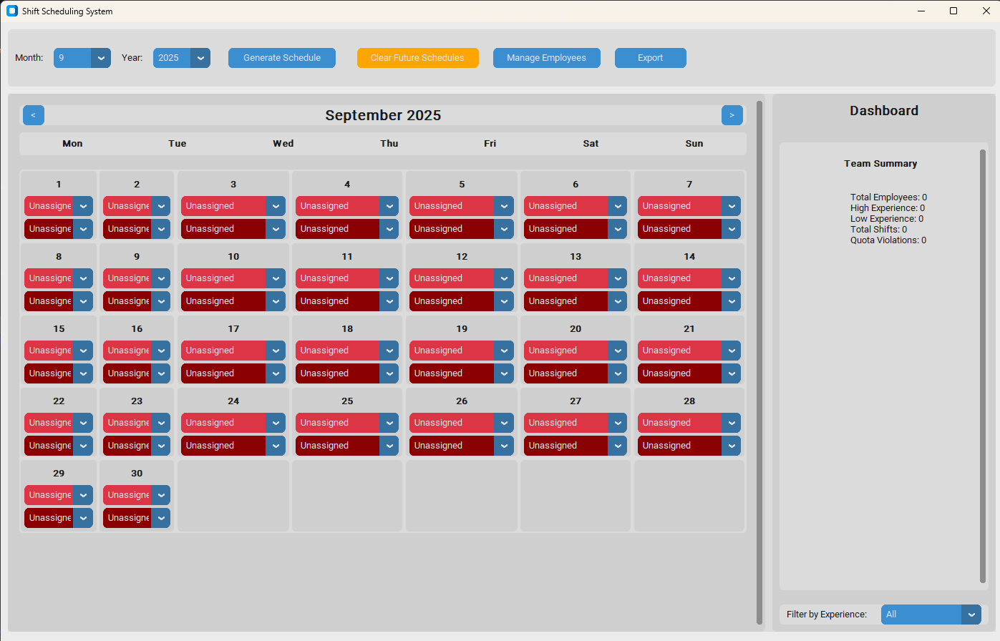

# Shift Scheduler System

[](https://github.com/akhilannan/shift-scheduler/actions/workflows/build-release.yml)
[](https://opensource.org/licenses/MIT)

A comprehensive Windows desktop application for managing employee shift schedules with a focus on fair, experience-based allocation and constraint satisfaction.



## Key Features

-   **Experience-Based Scheduling**: Automatically assigns shift quotas based on employee experience levels (High/Low).
-   **Constraint Validation**: Enforces rest rules (e.g., no shift after a night shift) and prevents scheduling conflicts.
-   **Interactive Calendar**: A clear monthly view with easy manual adjustments and color-coded shifts.
-   **Real-time Dashboard**: Provides at-a-glance statistics, quota tracking, and highlights any rule violations.
-   **Multiple Export Formats**: Export schedules and reports to PDF, Excel, and CSV for easy sharing and analysis.
-   **Intelligent Generation**: Uses a CP-SAT solver and a backtracking algorithm to find optimal, conflict-free schedules.

---

## Getting Started

This guide provides instructions for both regular users and developers.

### For End-Users (Recommended)

If you just want to use the application, you can download the latest pre-built version for Windows.

1.  **Go to the [GitHub Releases Page](https://github.com/akhilannan/shift-scheduler/releases).**
2.  Under the latest release, find the **Assets** section.
3.  Download the `ShiftScheduler-vX.X.X-windows.zip` file (where `X.X.X` is the version number).
4.  Unzip the file and run `ShiftScheduler.exe`.

### For Developers

If you want to run the application from the source code or contribute to its development.

**Prerequisites:**
-   Python 3.10 or higher
-   Windows 10/11

**1. Clone the repository:**
```bash
git clone https://github.com/akhilannan/shift-scheduler.git
cd shift-scheduler
```

**2. Install dependencies:**
The project uses `pyproject.toml` to manage dependencies. To install everything, including development tools like `pytest`, run:
```bash
pip install -e .[dev]
```

**3. Run the application:**
```bash
python -m shift_scheduler.main
```
Or directly:
```bash
python src/shift_scheduler/main.py
```

---

## Technical Deep Dive

### Project Structure

```
src/shift_scheduler/
├── __init__.py          # Package initialization
├── main.py              # Application entry point and GUI integration
├── data_manager.py      # Handles all JSON data persistence and CRUD operations
├── scheduler_logic.py   # Core scheduling algorithm (CP-SAT and constraints)
├── ui.py                # CustomTkinter GUI, calendar view, and dashboard
└── reporting.py         # PDF, Excel, and CSV export functionality
```

### Key Components

-   **Data Manager (`data_manager.py`):** Serves as the single source of truth for all application data. It handles loading, saving, and migrating the `schedule_data.json` file and provides a clean API for all data operations.
-   **Scheduler Logic (`scheduler_logic.py`):** The brain of the application. It uses Google's OR-Tools (CP-SAT solver) to model the scheduling problem as a set of constraints and objectives, finding an optimal solution that respects all business rules.
-   **User Interface (`ui.py`):** A modern GUI built with CustomTkinter. It features an interactive calendar, a real-time dashboard with filtering, and dialogs for managing employees and their preferences.
-   **Reporting (`reporting.py`):** Generates professional, print-friendly reports. It can create PDF calendars with visual badges, detailed Excel spreadsheets with statistics, and simple CSV exports.

### Algorithm and Business Rules

The application is built around a set of core business rules defined in the BRD.

-   **Experience-Based Quotas:** Employees are categorized as "High" or "Low" experience, with higher monthly shift quotas assigned to high-experience staff.
-   **Rest Period Constraints:**
    -   An employee cannot work a day shift and a night shift on the same day.
    -   An employee cannot work *any* shift on the day immediately following a night shift.
-   **Absence and Preferences:** The scheduler fully respects employee-defined off-shifts and absences.
-   **Emergency Handling:** In situations where an employee is absent, the system can redistribute shifts, prioritizing high-experience employees to cover the gaps.

| Month Length | High Experience Quota | Low Experience Quota |
|--------------|-----------------------|----------------------|
| 28 days      | 22 shifts             | 18 shifts            |
| 29 days      | 22 shifts             | 21 shifts            |
| 30 days      | 23 shifts             | 21 shifts            |
| 31 days      | 24 shifts             | 21 shifts            |

---

## Testing

The project has a comprehensive test suite using `pytest`. The tests cover data integrity, constraint validation, and core scheduling logic.

To run the full test suite:
```bash
pytest
```

## Building the Executable

You can build the standalone `.exe` file from the source code using `pyinstaller`.

1.  **Install build dependencies:**
    ```bash
    pip install .[build]
    ```
2.  **Run PyInstaller:**
    The build command is configured in `build-release.yml` and can be run locally:
    ```bash
    pyinstaller --onefile --windowed --name ShiftScheduler --icon=assets/icon.ico src/shift_scheduler/main.py
    ```
    The final executable will be located in the `dist/` directory.

## License

This project is licensed under the MIT License. See the [LICENSE](LICENSE) file for details.